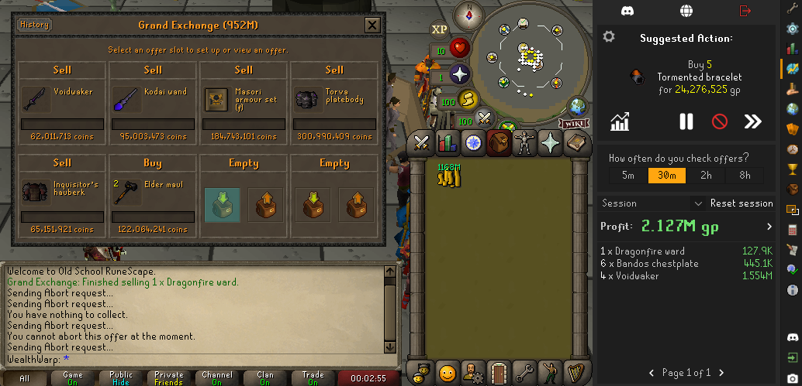
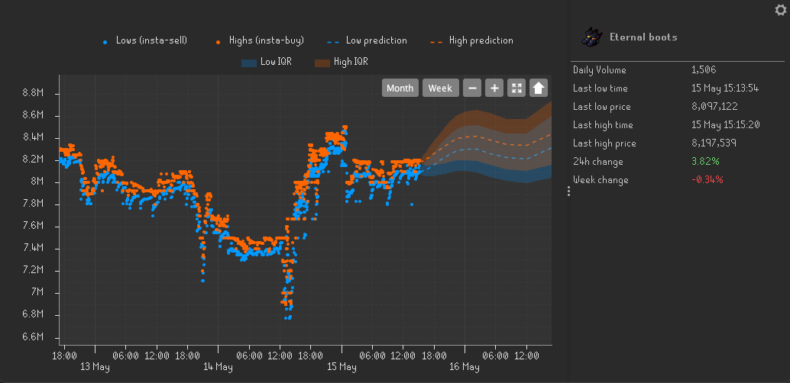
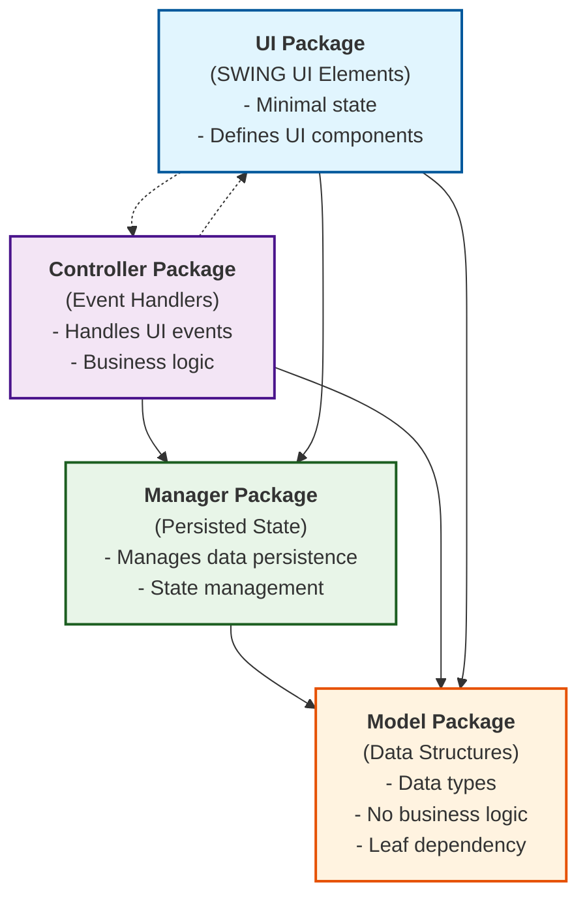

# Flipping Copilot

Flipping Copilot is an AI-powered assistant designed to enhance your trading experience in Old School RuneScape. With its advanced algorithms and market analysis, Flipping Copilot provides intelligent suggestions on which items to flip, optimal prices and quantities for buying and selling, and when to cancel existing offers to maximize your profit per hour.

## Community
Join our [Discord server](https://discord.gg/UyQxA4QJAq) to engage with fellow users, discuss the project, ask questions, and receive support. Our community is dedicated to helping you make the most of Flipping Copilot and enhancing your trading experience in Old School RuneScape.

## Features
 - Intelligent item suggestions
 - Optimal price and quantity suggestions
 - Real-time offer cancellation suggestions
 - Quant-model price predictions
 - Cross-device flip tracking
 - Price graphs, stats and more!

## Attribution
Icons were created by cbrewitt or sourced from Flaticon. The following attributions are provided in accordance with the Flaticon license agreement.
<a href="https://www.flaticon.com/free-icons/internet" title="internet icons">Internet icons created by Freepik - Flaticon</a>

Some code was used from Runelite Plugins (BSD 2-Clause License):
- [Flipping Utilities](https://github.com/Flipping-Utilities/rl-plugin?tab=readme-ov-file)
- [Flipper](https://github.com/OkayestDev/OSRS-Flipper)
- [Discord Level Notifications](https://github.com/ATremonte/Discord-Level-Notifications)

## Development 

### System design

Design is based loosely on a model/view/controller architecture:

* UI classes (in the `ui` package) define the actual UI elements using the SWING library. They should have none or minimal state.
* Controller classes (in the `controller` package) are connected to UI classes and define the handling logic for events or UI actions like a button click happen. So UI classes depend on controller classes. Since the downstream effects of some logic in a controller class may require something on the UI to update, controller classes can also call to UI classes. Therefore, there is a bi-direction dependency between controller and UI classes.
* Model classes (in the `model` package) define types for the data model. They should primarily be data structures without any logic. Model classes should be a leaf on the dependency graph. Everything else can depend on them, but they should not depend/import anything from the other packages.
* Manager classes (in the `manager` package) manage persisted state. Manager classes should depend only on model classes. And are a dependency of both controller and UI classes.

### Threading concerns

Runelite is a multithreaded application, therefore we need to worry about synchronisation, data visibility etc... There are the following threads to consider:

* `ClientThread` - this is the main game thread. The handlers of subscribed events execute in this thread or calls to `clientThread.invoke(`. This thread is special in that most game related Runelite stuff can only be interacted with from this thread.
* `ScheduledExecutorService` (default) - this is a thread pool instance already running in Runelite with a single thread that you can inject and call `schedule` to run stuff in.
* `ExecutorService` (copilot) - this is our own thread pool instance that we can use to run background tasks. It has two threads.
* `SWING EDT` - This is the SWING events thread. When you setup handlers to UI events like button clicks they will be executed in this thread.
* `OkHttpClient Dispatcher` - This is a thread pool managed by the OkHttpClient with several threads. When you submit async HTTP request the callbacks will be executed by this thread.

